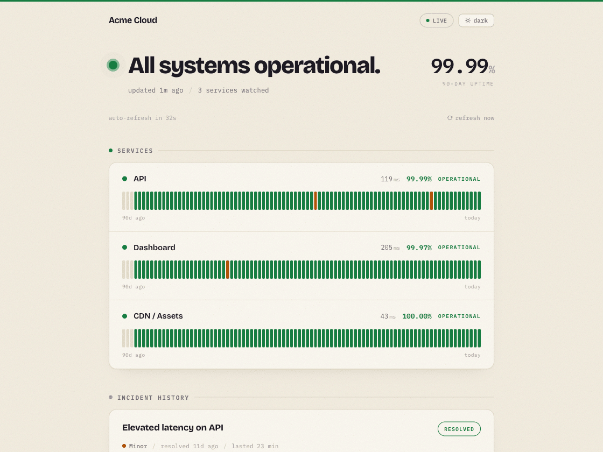

# UptimeCrow

Open-source status pages that stay up when you're down. Built-in uptime monitoring feeds your public status page: incidents open automatically, subscribers get notified, and the page itself is pre-rendered so it keeps serving even when your origin goes down. Self-host under AGPL-3.0 or use the hosted cloud.




> **Open core.** This repository is the full self-hostable platform under AGPL-3.0. The managed service at [uptimecrow.com](https://uptimecrow.com) runs the same code plus a small set of managed-only add-ons for larger teams. See [OPEN_CORE.md](./OPEN_CORE.md) for the exact split.

## Features

- **Pre-Rendered Status Pages** — Static HTML/JSON pages survive origin downtime; your users see status even when you're down
- **Branded Status Pages** — Custom logo, brand color, custom domain, private-access tokens, embeddable SVG badges
- **Built-In Uptime Monitoring** — HTTP / TCP / keyword checks with configurable interval, timeout, expected status codes, and keyword-in-body matching
- **No False Alarms** — A monitor must fail N consecutive checks (default 2) before an incident opens, so a single network blip never pages anyone
- **Automatic Incidents** — Real outages open incidents and update your status page with no human in the loop; manual incidents and updates supported
- **Subscriber Management** — Double opt-in verification, one-click unsubscribe (HTML confirmation pages)
- **Email + Chat Notifications** — Amazon SES for transactional email to subscribers; native Slack, Discord, and custom webhooks
- **Maintenance Windows** — Planned downtime is announced on the page and suppresses alerts; windows can repeat weekly or monthly
- **SSL & Domain Expiry** — Certificate and WHOIS expiry checked daily with a configurable warning threshold
- **Badges & Feeds** — Embeddable SVG uptime badge and an RSS incident feed per status page
- **Multi-Tenancy** — Organization-scoped resources
- **Tiered Plans** — Free, Indie, Pro, and Team with enforced limits on monitors, pages, intervals, and retention
- **Billing** — Polar integration with Standard Webhooks signature verification

## How this compares

| | UptimeCrow | Uptime Kuma | Atlassian Statuspage |
|---|---|---|---|
| Monitoring | HTTP / TCP / keyword | Extensive protocol list | None — you post updates |
| Status pages | The point of the product: pre-rendered, multi-tenant, custom domain | Included, simpler | The point of the product |
| Survives your origin going down | Pages are static files, served independently | Dies with the host it runs on | Yes (hosted) |
| Self-host | Yes, AGPL-3.0 | Yes, MIT | No |
| Hosted option | Yes | No | From $29/mo |

Kuma is excellent and probably the right answer if you want a private dashboard
for a homelab. UptimeCrow is for the case where the *public* page matters — the
one your customers refresh at 3am — and it must not live in the same failure
domain as the thing it reports on.

## Plan Limits

| Feature | Free | Indie | Pro | Team |
|---|---|---|---|---|
| Price | $0 | $19/mo | $49/mo | Talk to us |
| Status Pages | 1 | 5 | 10 | Unlimited |
| Monitors | 10 | 50 | 100 | 200 |
| Min Interval | 5 min | 1 min | 30 sec | 30 sec |
| Data Retention | 7 days | 1 year | 1 year | 1 year |
| Custom Domain | No | Yes | Yes | Yes |
| Slack / Discord / webhooks | No | Yes | Yes | Yes |

> **Self-hosting?** The AGPL-3.0 core is unlimited and free forever — these limits apply only to the managed cloud at [uptimecrow.com](https://uptimecrow.com).

## Tech Stack

| Layer | Technology |
|---|---|
| Backend | [Hono](https://hono.dev) + TypeScript |
| ORM | [Drizzle ORM](https://orm.drizzle.team) |
| Job Queue | [BullMQ](https://bullmq.io) |
| Frontend | React 18 + Vite + Tailwind CSS |
| Database | PostgreSQL 16 |
| Cache/State | Redis 7 |
| Email | [Amazon SES](https://aws.amazon.com/ses/) (`@aws-sdk/client-sesv2`) |
| Billing | [Polar](https://polar.sh) |
| Infra | Docker, pnpm workspaces |

## Architecture

```
uptimecrow/
├── apps/
│   ├── api/                 # Hono backend + BullMQ workers
│   │   ├── src/
│   │   │   ├── routes/      # Auth, monitors, incidents, status pages, subscribers, maintenance, settings, billing, public
│   │   │   ├── services/    # Monitor checks, notifications (SES/Slack/Discord), static gen
│   │   │   ├── routes/billing.ts  # Polar checkout, customer portal, webhook
│   │   │   ├── jobs/        # BullMQ handlers: check, notify, generate
│   │   │   ├── middleware/  # JWT auth (cookie + Bearer header), rate limiting
│   │   │   ├── db/          # Drizzle schema & connection
│   │   │   ├── web.ts       # Serves the built SPA in production
│   │   │   └── utils/       # JWT helpers, SSRF guard, state machine
│   │   └── Dockerfile       # Builds the API *and* the web app into one image
│   └── web/                 # Vite React SPA
│       ├── src/
│       │   └── pages/       # Landing, Dashboard, Login
│       ├── scripts/
│       │   └── prerender.mjs  # Writes static HTML per marketing route
│       ├── nginx.conf       # Only used by the development compose file
│       └── Dockerfile
├── packages/
│   └── shared/              # Types, constants, Zod validation schemas
├── docker-compose.yml
└── .github/workflows/       # CI (lint, test, docker build) + Deploy (GHCR)
```

### How It Works

```
                    ┌─────────────┐
                    │  BullMQ Job │  Repeatable per monitor
                    └──────┬──────┘
                           │
                    ┌──────▼──────┐
                    │  HTTP Check  │  executeHttpCheck()
                    └──────┬──────┘
                           │
                    ┌──────▼──────┐
                    │ State Machine│  Redis failure counter
                    └──────┬──────┘
                           │
               ┌───────────┼───────────┐
               │                       │
        No transition            Transition detected
        (store result)           (UP→DOWN or DOWN→UP)
                                       │
                          ┌────────────┴────────────┐
                          │                         │
                   ┌──────▼──────┐         ┌────────▼─────┐
                   │   Notify    │         │  Regen Page  │
                   │ (SES/Slack/ │         │   (Static)   │
                   │  Discord)   │         │              │
                   └─────────────┘         └──────────────┘
```

- **Static pages are pre-rendered** to in-memory storage so they're served instantly and survive origin failures
- **2 consecutive failures** (configurable via `confirmationCount`) required before marking a monitor DOWN
- **Side effects only on state transitions** — routine checks just persist a `check_results` row

### API Mode

The API process supports three modes via the `MODE` environment variable:

| Mode | What runs |
|---|---|
| `api` | HTTP server only |
| `worker` | BullMQ workers only |
| `all` | Both (default for development) |

This allows you to scale API servers and workers independently in production.

## Getting Started

### Prerequisites

- [Docker](https://docs.docker.com/get-docker/) and Docker Compose
- [Node.js](https://nodejs.org/) >= 20 (for local IDE support)
- [pnpm](https://pnpm.io/) >= 9

### Quick Start (Docker, development)

```bash
git clone https://github.com/ozers/uptimecrow.git
cd uptimecrow
cp .env.example .env
docker compose up
```

This starts:
- **PostgreSQL 16** on port `5432`
- **Redis 7** on port `6379`
- **API** on port `3000` (with hot-reload; runs migrations on start)
- **Web** on port `5173` (Vite dev server with hot-reload)

Open [http://localhost:5173](http://localhost:5173) and register an account —
the first one you create owns its own organization.

In development the web app runs as its own container so you get Vite's
hot-reload. In production there is no separate web container: the API serves the
built SPA from the same origin.

Already running Postgres or Redis locally? Set `POSTGRES_PORT`, `REDIS_PORT`,
`API_PORT` or `WEB_PORT` in `.env` rather than stopping your own services.

### Production self-host

For an actual production deploy on a VPS, use `docker-compose.prod.yml` — it pulls pre-built images from GHCR, runs the API in production mode, and runs migrations automatically on startup.

```bash
cp .env.prod.example .env
# Edit .env — set POSTGRES_PASSWORD, JWT_SECRET, APP_URL (required).
# Generate strong secrets with: openssl rand -hex 32

# Pin a release rather than tracking latest:
#   UPTIMECROW_VERSION=v0.1.0
docker compose -f docker-compose.prod.yml up -d
docker compose -f docker-compose.prod.yml logs -f api
```

Everything is on port `80`: the app container serves the web UI and the API from one origin. Put Caddy or nginx in front for TLS. Email (SES) and billing (Polar) integrations are optional — UptimeCrow runs fine with just the three core containers (Postgres, Redis, app).

### Telemetry

**Off by default.** The code contains a `track()` helper that posts product
events to a self-hosted [event-beacon](https://github.com/ozers/event-beacon)
instance, and it is a no-op unless you set both `BEACON_URL` and `BEACON_KEY`.
A self-hosted install sets neither, so nothing leaves your server — no
phone-home, no version check, no usage ping. The hosted service sets them, and
what it sends is the event name, a handful of non-identifying properties (plan
tier, monitor type) and the opaque user id — never emails, URLs or check
results. The code is `apps/api/src/utils/beacon.ts`; it is 30 lines.

### Local Development (without Docker)

```bash
pnpm install
cp .env.example .env
# Edit .env with your local PostgreSQL/Redis URLs

pnpm db:migrate

pnpm dev:api    # http://localhost:3000
pnpm dev:web    # http://localhost:5173
```

## Environment Variables

| Variable | Required | Default | Description |
|---|---|---|---|
| `DATABASE_URL` | Yes | — | PostgreSQL connection string |
| `REDIS_URL` | Yes | — | Redis connection string |
| `JWT_SECRET` | Yes | — | Secret for signing JWTs (must be changed in production) |
| `MODE` | No | `all` | API process mode: `api`, `worker`, or `all` |
| `PORT` | No | `3000` | API server port |
| `NODE_ENV` | No | `development` | Environment |
| `LOG_LEVEL` | No | — | Pino log level override (`info` in prod, `debug` in dev by default) |
| `VITE_PLAUSIBLE_DOMAIN` | No | — | Plausible Analytics site domain (web build-time) |
| `APP_URL` | No | `http://localhost:5173` | Base URL for links in emails |
| `STATUS_PAGE_URL` | No | `http://localhost:5173/status` | Public status page base URL |
| `AWS_ACCESS_KEY_ID` | No¹ | — | AWS credentials for SES |
| `AWS_SECRET_ACCESS_KEY` | No¹ | — | AWS credentials for SES |
| `AWS_REGION` | No¹ | `us-east-1` | AWS region for SES |
| `SES_FROM_EMAIL` | No¹ | — | Verified "from" address in SES |
| `POLAR_ACCESS_TOKEN` | No² | — | Polar API token |
| `POLAR_WEBHOOK_SECRET` | No² | — | Polar webhook signing secret (base64) |
| `POLAR_<PLAN>_<INTERVAL>_PRODUCT_ID` | No² | — | Polar **product** id per plan and interval, e.g. `POLAR_INDIE_MONTHLY_PRODUCT_ID`. Product ids, not price ids — Polar removed price-level ids from checkout |
| `UPTIMECROW_VERSION` | No | `latest` | Image tag read by `docker-compose.prod.yml`. Pin a release |
| `WEB_ROOT` | No | `../../web` | Where the API looks for the built SPA, relative to its working directory |
| `BEACON_URL` / `BEACON_KEY` | No | — | Product analytics endpoint. **Both unset means nothing is sent** — see [Telemetry](#telemetry) |
| `SENTRY_DSN` | No | — | Error tracking. No DSN, no reporting |
| `ALLOW_PRIVATE_TARGETS` | No | — | `1` lets monitors and webhooks reach private/loopback addresses. For local development only — this disables the SSRF guard |

¹ Required to send email notifications.
² Required to accept paid plan upgrades.

## Development Commands

```bash
# Docker
docker compose up                     # Start all services
docker compose up --build             # Rebuild and start

# Dependencies
pnpm install                          # Install all workspace dependencies

# Database
pnpm db:generate                      # Generate Drizzle migration files
pnpm db:migrate                       # Run migrations

# Quality
pnpm typecheck                        # TypeScript check across all packages
pnpm test                             # Run all tests (vitest)

# Per-package
pnpm --filter @uptimecrow/api test    # Run API tests only
pnpm --filter @uptimecrow/web build   # Build web (also writes the pre-rendered routes)

# A single test file
pnpm --filter @uptimecrow/api exec vitest run src/utils/ssrf.test.ts
```

## API Endpoints

The full surface is documented by the OpenAPI spec the server generates:
interactive Swagger UI at **`/api/docs`**, raw document at
**`/api/openapi.json`**. That spec is generated from the running app, so it
cannot drift from reality the way a hand-written list does. The shape:

| Area | Routes |
|---|---|
| Auth | `POST /api/auth/{register,login,logout,forgot-password,reset-password}`, `GET /api/auth/me` |
| Monitors | CRUD on `/api/monitors`, plus `GET /api/monitors/:id/checks` and `POST /api/monitors/test` |
| Incidents | CRUD on `/api/incidents`, plus `POST /api/incidents/:id/updates` |
| Status pages | CRUD on `/api/status-pages`, plus `PUT /:id/monitors`, `PUT /:id/domain`, `POST /:id/regenerate-token` |
| Maintenance | CRUD on `/api/maintenance-windows` |
| Subscribers | `GET /api/subscribers`, `DELETE /api/subscribers/:id` |
| Settings | `GET`/`PATCH /api/settings`, `POST /api/settings/test-webhook` |
| Billing | `POST /api/billing/{checkout,portal,webhook}` |

Authenticated routes take a JWT as an HTTP-only cookie or an
`Authorization: Bearer` header. Tokens last 7 days and are scoped to an
organization.

### Public routes (no auth)

| Method | Path | Description |
|---|---|---|
| `GET` | `/status/:slug` | Status page (HTML) |
| `GET` | `/status/:slug?format=json` | The same data as JSON |
| `GET` | `/status/:slug/incidents` | Incident history |
| `GET` | `/status/:slug/rss` | Incident feed |
| `POST` | `/status/:slug/subscribe` | Subscribe by email (double opt-in) |
| `GET` | `/badge/:slug.svg` | Embeddable uptime badge |
| `GET` | `/health` | Deep health check — returns 503 if Postgres or Redis is unreachable |

Embed a badge in your own README:

```markdown

```

## Database Schema

Seventeen tables. Twelve carry the product:

- **users** — accounts with email, password hash, plan tier
- **organizations** / **org_members** — multi-tenant scoping; every resource is org-scoped
- **monitors** — type, URL, interval, timeout, expected status, confirmation count, SSL/domain expiry state
- **check_results** — the time series: status, response time, status code, error
- **status_pages** — slug, custom domain, logo, brand colour, access token
- **status_page_monitors** — which monitors appear on which page
- **incidents** / **incident_updates** — the incident and its timeline
- **subscribers** — per status page, with double opt-in verification
- **maintenance_windows** / **maintenance_window_monitors** — planned downtime, with an optional recurrence rule

Five are **dead by design** — left in place because dropping columns needs a
migration plan, not because anything reads them: `heartbeats`, `api_keys`,
`org_invites`, `on_call_schedules`, `on_call_contacts`. They are the remains of
features removed when the product refocused on status pages. Do not build on
them without reading [CLAUDE.md](./CLAUDE.md) first.

## Deployment

### Docker Production Build

One image carries the API, the worker and the web UI:

```bash
docker build -t uptimecrow --target production -f apps/api/Dockerfile .
docker run -p 80:3000 --env-file .env uptimecrow
```

Or pull a published release instead of building:

```bash
docker pull ghcr.io/ozers/uptimecrow/api:v0.1.0
```

### CI/CD

GitHub Actions workflows:

- **CI** (`.github/workflows/ci.yml`) — Runs on PRs and pushes to main: TypeScript check, tests with PostgreSQL 16 + Redis 7 service containers, Docker build validation, and a Trivy scan of dependencies and config.
- **Deploy** (`.github/workflows/deploy.yml`) — Publishes images to GitHub Container Registry after CI passes on main. Pushing a `v*.*.*` tag also publishes `:v1.2.3` and `:1.2`, which is what you should pin in production.

### Production Checklist

- [ ] Set a strong, random `JWT_SECRET` (startup will fail in production if it's the default)
- [ ] Configure Amazon SES (`AWS_ACCESS_KEY_ID`, `AWS_SECRET_ACCESS_KEY`, `AWS_REGION`, `SES_FROM_EMAIL`) with a verified sender domain
- [ ] Configure Polar (`POLAR_ACCESS_TOKEN`, `POLAR_WEBHOOK_SECRET`, product IDs) and point the Polar dashboard webhook at `/api/billing/webhook`
- [ ] Set `APP_URL` and `STATUS_PAGE_URL` to your production domain
- [ ] Pin `UPTIMECROW_VERSION` to a release tag instead of tracking `latest`
- [ ] Split `MODE=api` and `MODE=worker` into separate processes if you need to scale checks independently — one `MODE=all` container is fine to start
- [ ] Set up PostgreSQL with proper backups and connection pooling
- [ ] Configure Redis persistence if you need state machine durability across restarts
- [ ] Put a CDN in front of `/status/:slug` for further origin-downtime resilience

## Contributing

Bug reports, reproductions and design proposals are as welcome as patches — see
[CONTRIBUTING.md](./CONTRIBUTING.md) for the dev setup and what we accept.
First-time contributors sign a one-line [CLA](./CLA.md); if you would rather
not, open an issue instead and we will take it from there.

Security issues go to [SECURITY.md](./SECURITY.md), never a public issue.

| | |
|---|---|
| What changed | [CHANGELOG.md](./CHANGELOG.md) · [Releases](https://github.com/ozers/uptimecrow/releases) |
| What is in scope | [OPEN_CORE.md](./OPEN_CORE.md) |
| Name and logo | [TRADEMARK.md](./TRADEMARK.md) |
| Questions | [Discussions](https://github.com/ozers/uptimecrow/discussions) |

## Supporting the project

If UptimeCrow is useful to you, the simplest way to support it is to [use the managed cloud](https://uptimecrow.com/pricing) — those plans fund the time spent here. A sponsor program for self-hosters is on the roadmap.

## License

UptimeCrow is licensed under the **GNU Affero General Public License v3.0**. See [LICENSE](./LICENSE) for the full text and [OPEN_CORE.md](./OPEN_CORE.md) for what's in the open core vs. managed-only. The name and the crow mark are covered separately — see [TRADEMARK.md](./TRADEMARK.md).

**Plain-English summary** (not legal advice):

- You can self-host UptimeCrow for free, forever, including for your company's internal use.
- You can modify it however you like.
- If you offer a modified version of UptimeCrow as a network service to third parties, AGPL requires you to publish your modifications under the same license.
- If your organization cannot use AGPL software, [contact us](mailto:hello@uptimecrow.com) about a commercial license.
